# Виды квартиры 36,67 м²

11 рендеров единой сцены Blender. Размеры приблизительные; мебель упрощена для последующей генерации фотографий.

## Общий объёмный макет

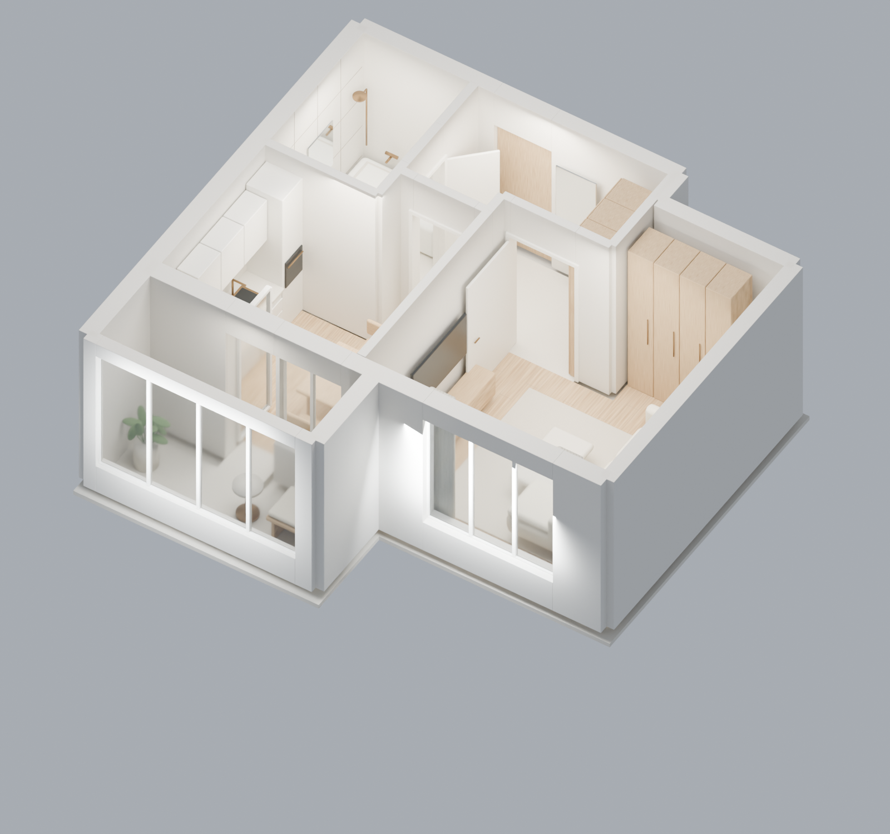

## План сверху

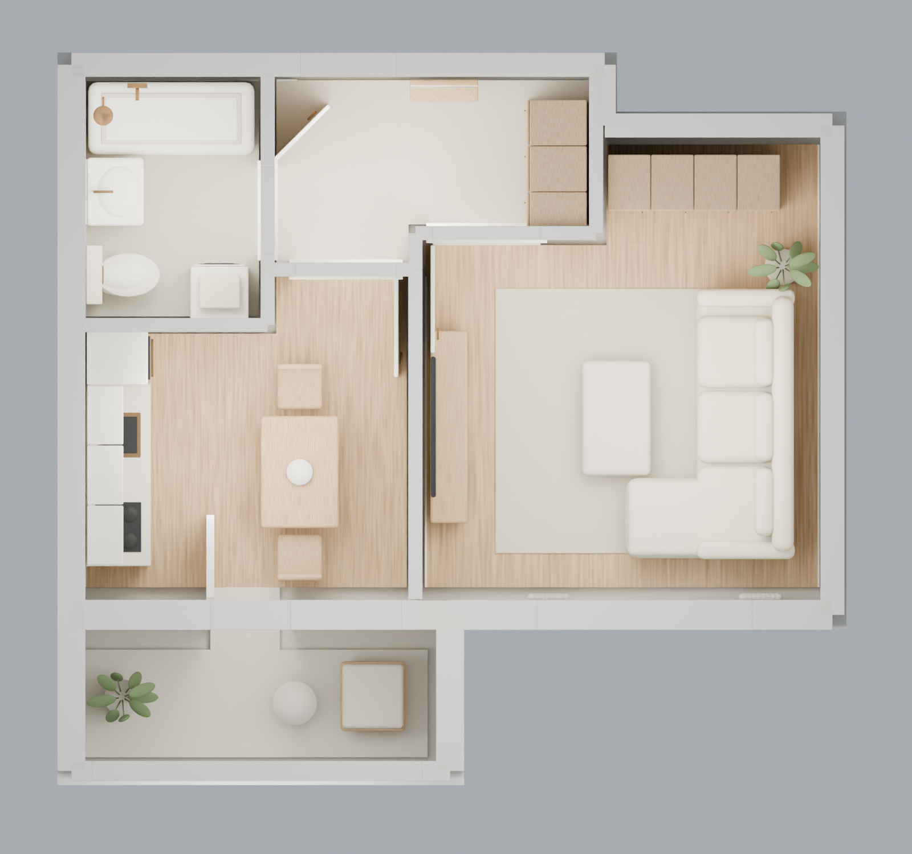

## Прихожая — от входа

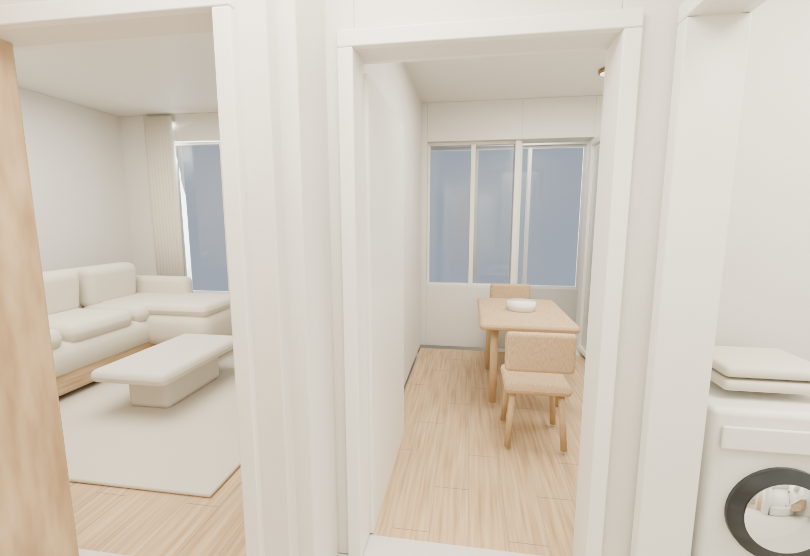

## Санузел — от двери

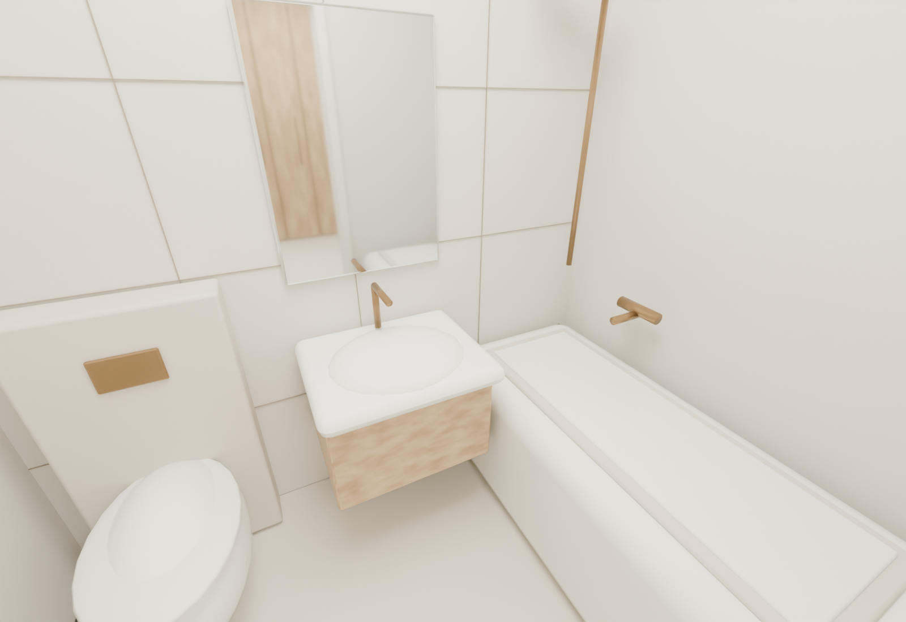

## Гостиная — общий вид

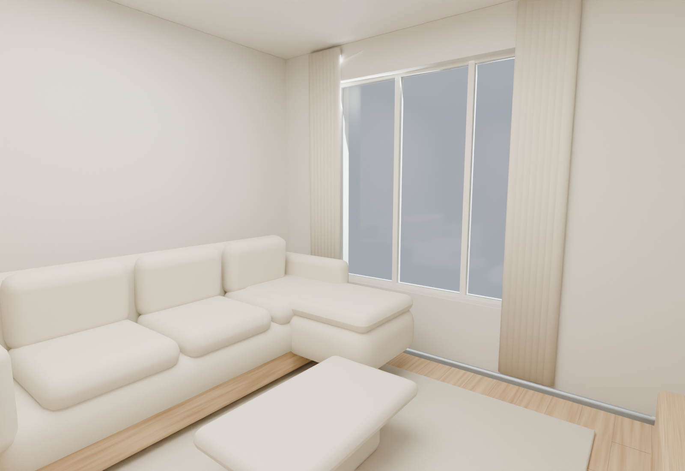

## Кухня — к лоджии

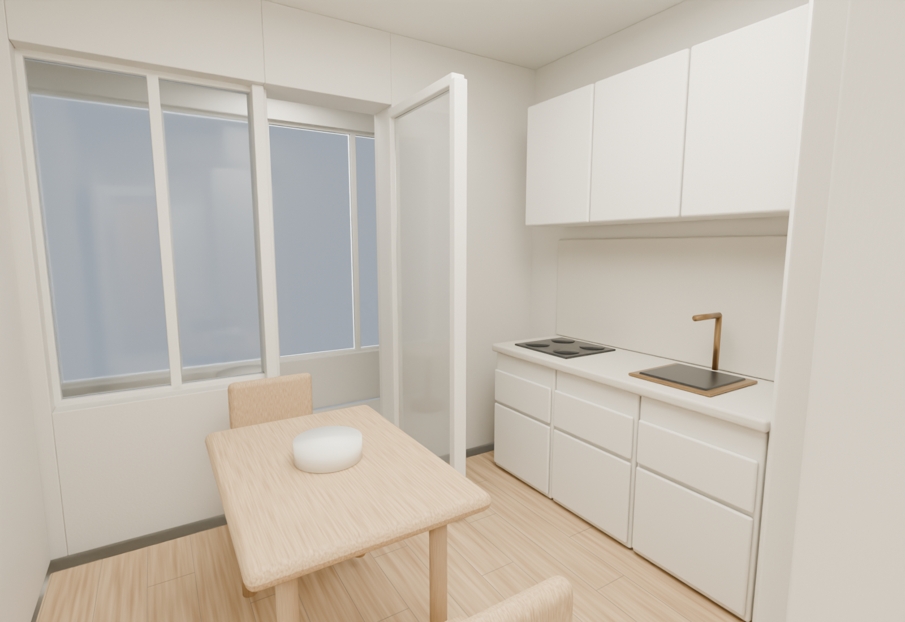

## Лоджия — общий вид

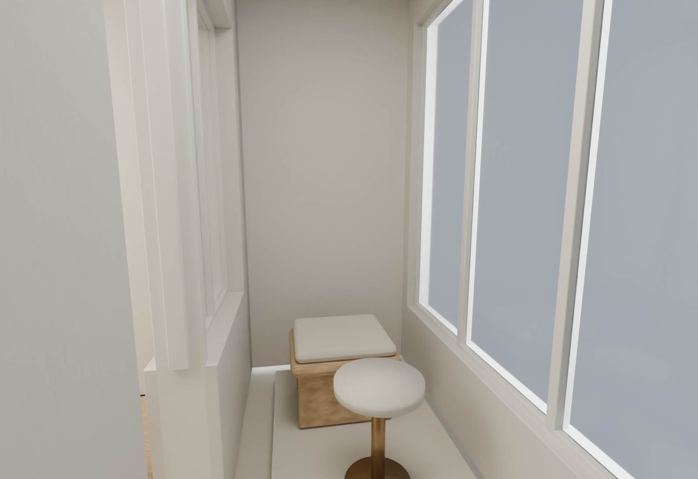

## Гостиная — обратный вид

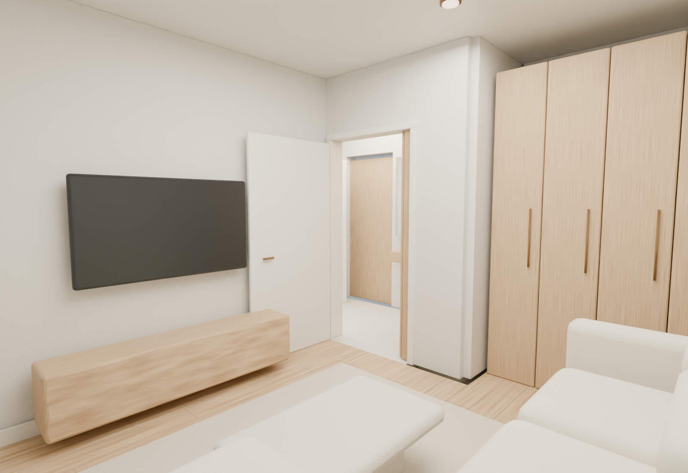

## Кухня — к прихожей

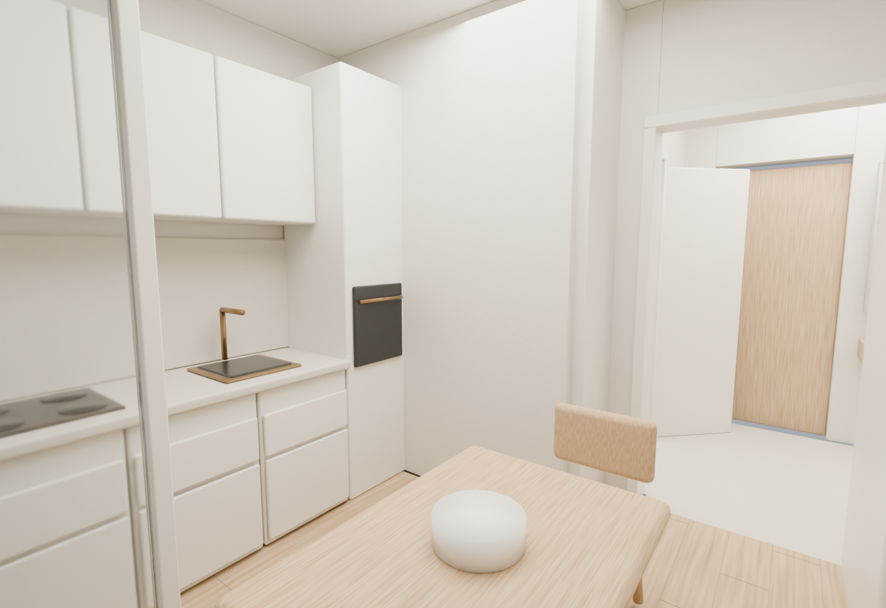

## Прихожая — к входной двери

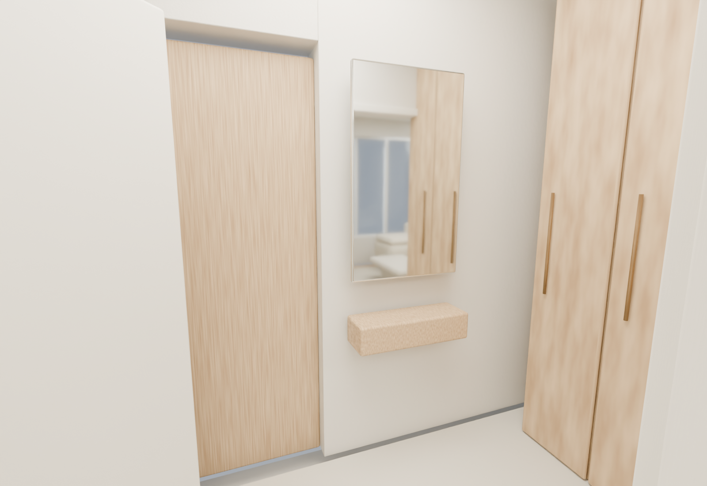

## Санузел — техника и унитаз

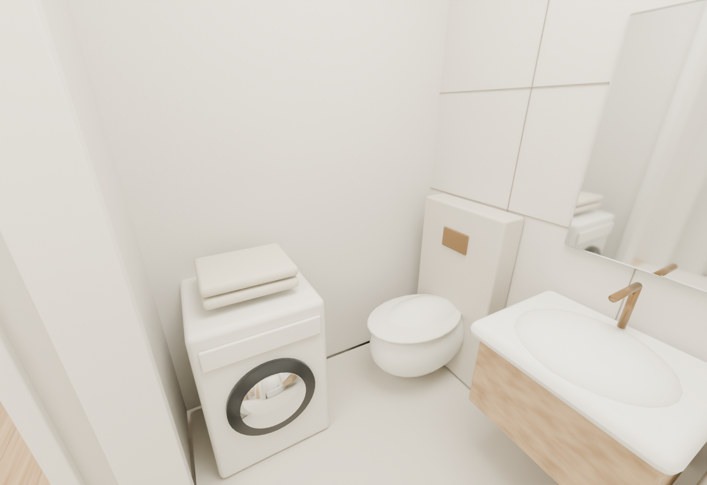
