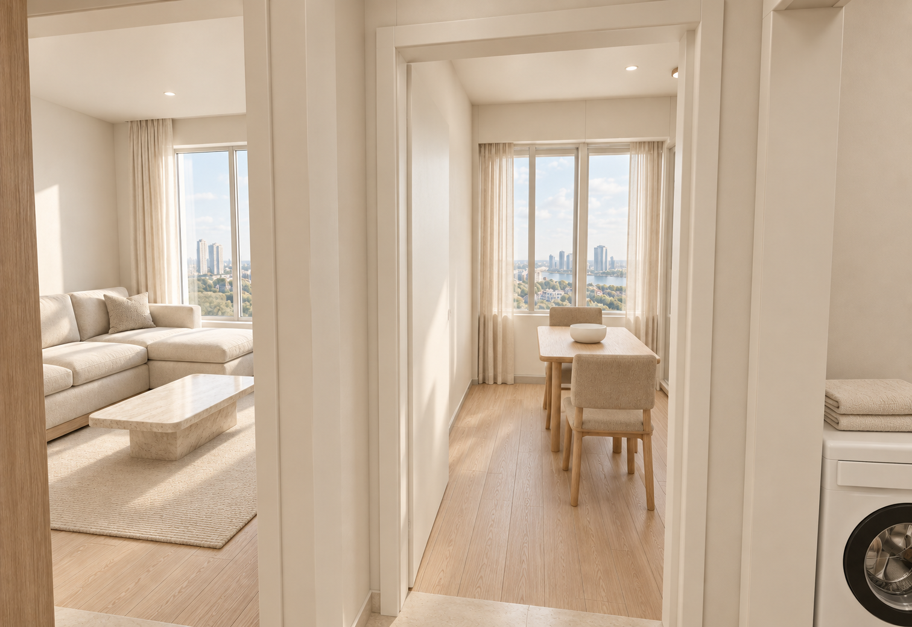
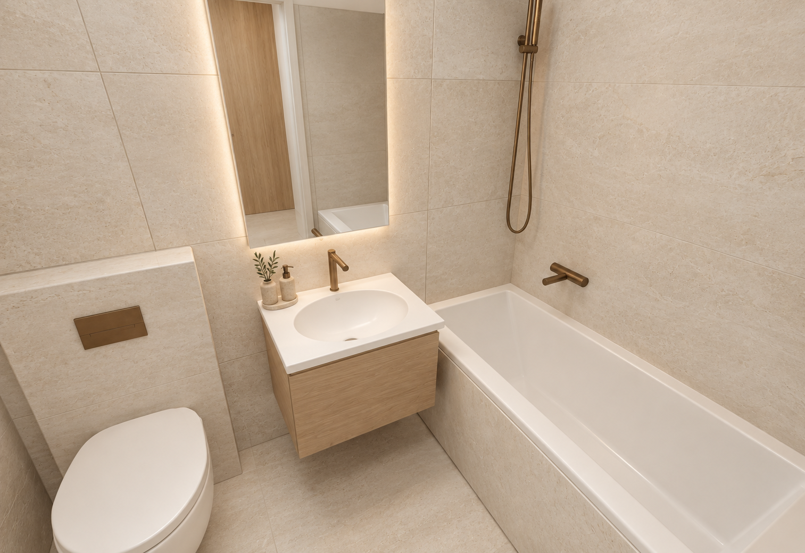
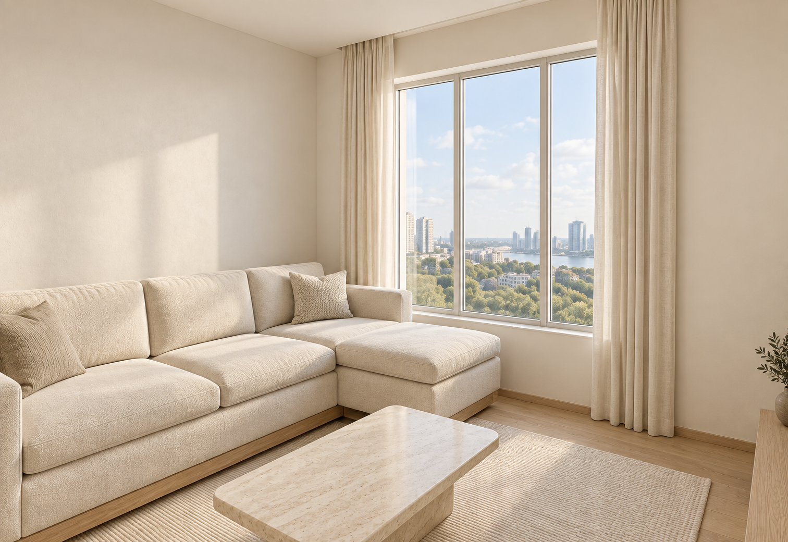
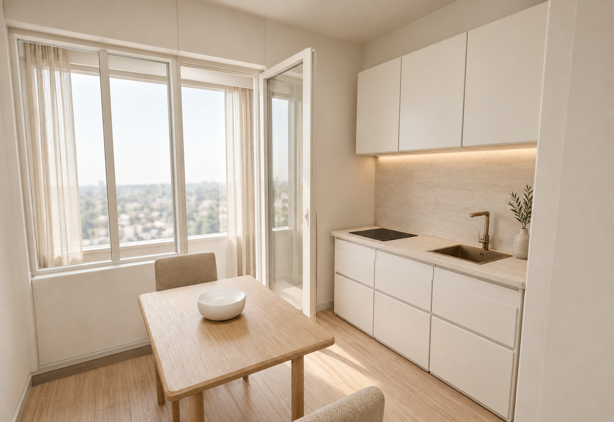
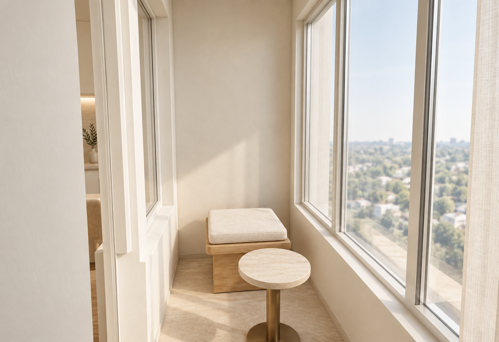
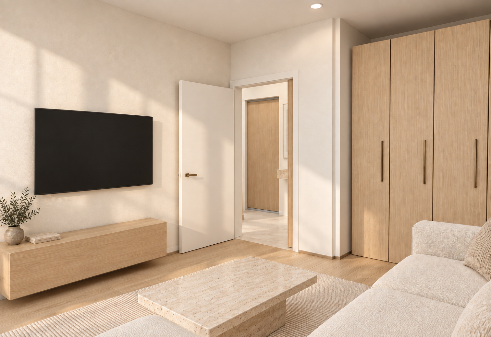
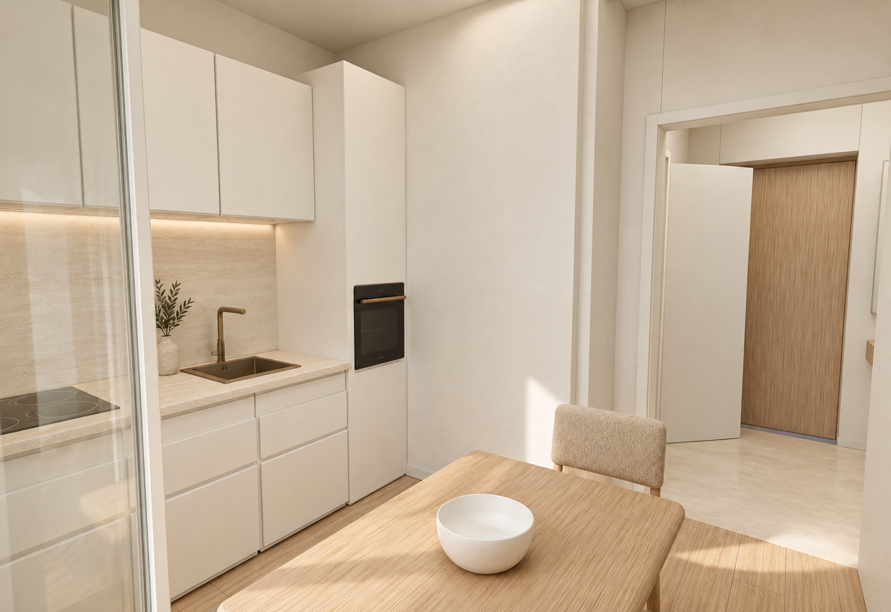
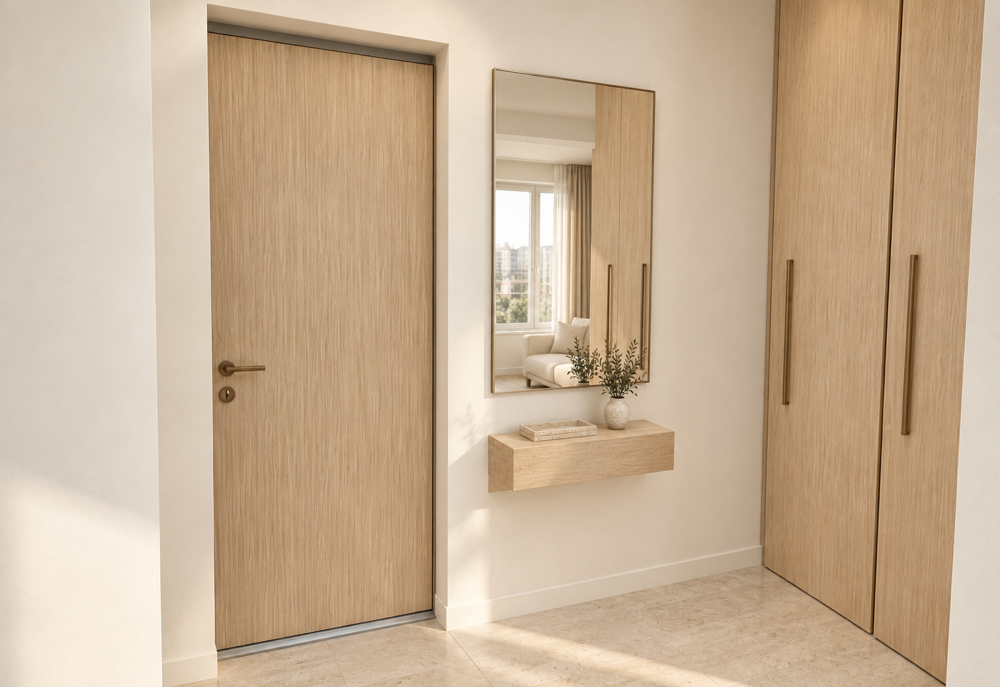
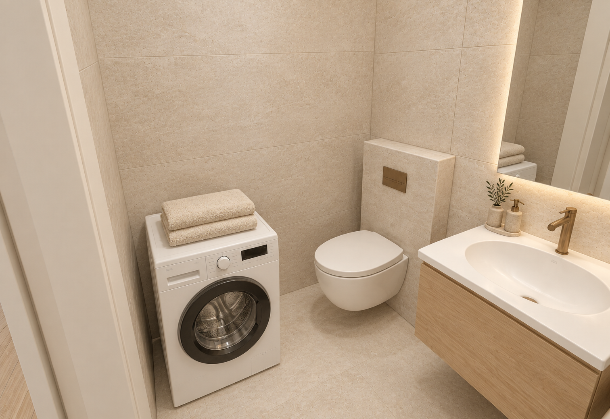

# Квартира 36,67 м² — тёплый современный интерьер

Демонстрационная визуализация. Авторский вариант интерьера по DESIGN_SYSTEM.md.

Создано встроенным image_gen на основе 9 ракурсов Blender. Общие планы 00 остаются геометрическими референсами. Исходные рендеры не заменены.

Генерация сохраняет основную композицию, но отдельные детали мебели, декор, отражения и виды за окнами могут различаться. Виды из окон вымышлены. Это не фотографии существующей отделки и не обмерные чертежи.

## Кадры

### Прихожая — от входа

Демонстрационная визуализация.

### Санузел — от двери

Демонстрационная визуализация.

### Гостиная — к окну

Демонстрационная визуализация.

### Кухня — к лоджии

Демонстрационная визуализация.

### Лоджия

Демонстрационная визуализация.

### Гостиная — обратный вид

Демонстрационная визуализация.

Версия 5: заново обработан исходный кадр 06-living-reverse.png за один проход для уменьшения накопленных артефактов. Тумба укорочена для зазора с открытой дверью, телевизор сдвинут левее, отражения с экрана убраны. Микротекстуры могут отличаться от оригинала.

### Кухня — к прихожей

Демонстрационная визуализация.

### Прихожая — к входной двери

Демонстрационная визуализация.

### Санузел — обратный вид

Демонстрационная визуализация.

