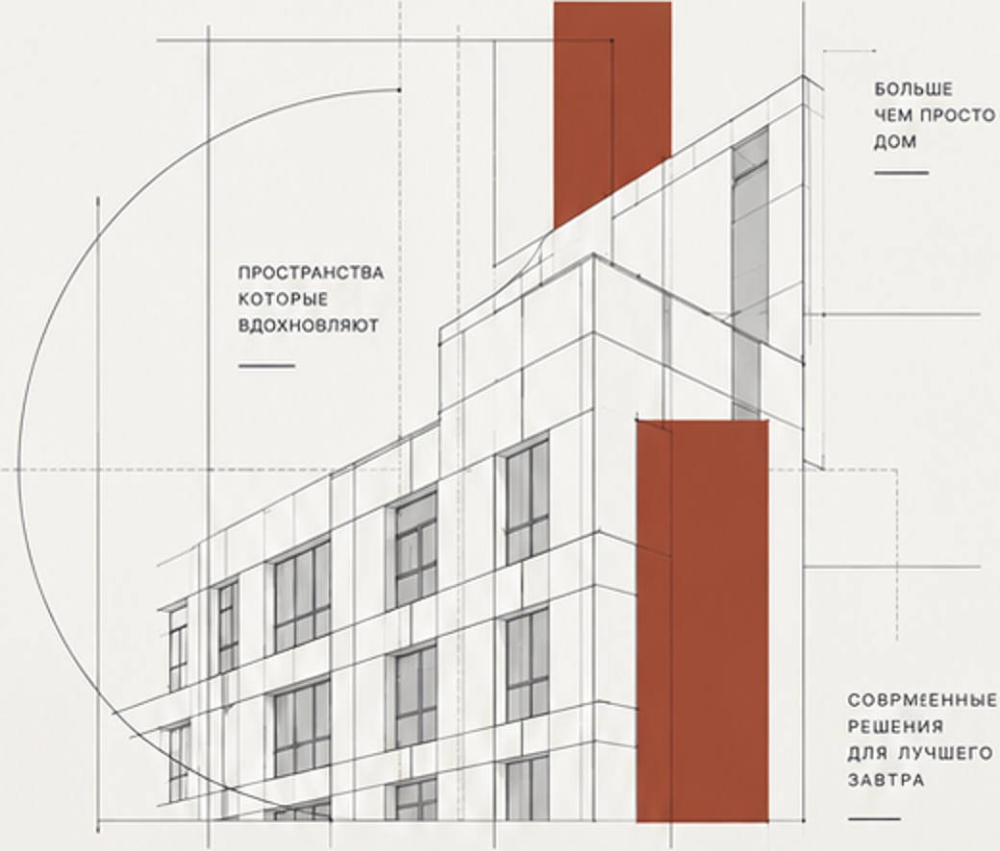
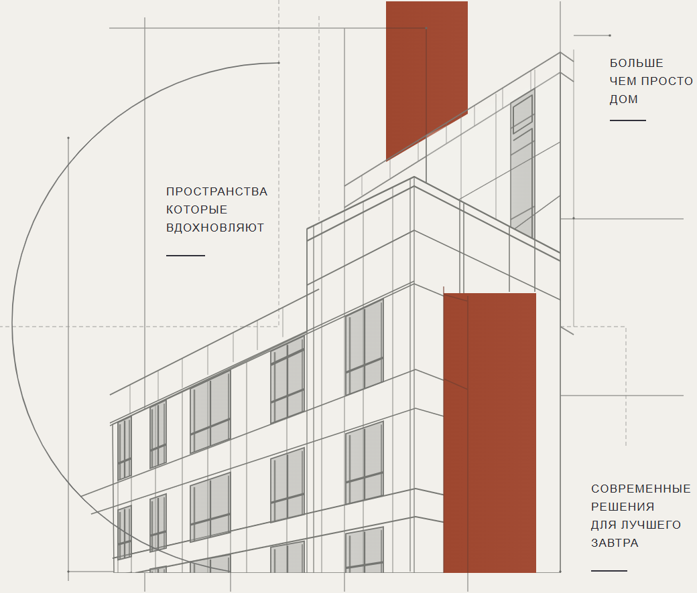

# Архитектурный чертёж первого экрана

Исходник: `06-trust-stroy-composed-reference.png`, область x=305–825, y=59–502 исходного изображения 845 × 1860 px.

Редактируемый вектор: [`company-blueprint.svg`](../../../website/src/assets/company-blueprint.svg). Размер 520 × 443, координаты `viewBox="305 59 520 443"` сохраняют привязку к исходнику. Растровых изображений внутри нет: 136 SVG paths, текстовые подписи и маркеры.

Повторная сборка: `python website/scripts/build_company_blueprint.py` из корня репозитория. Скрипт перезаписывает SVG; ручные изменения в SVG следует перенести в скрипт или сохранить отдельно.

## Визуальная проверка

Референс увеличен вдвое для проверки тонких линий. SVG отрисован браузером Chromium в том же размере 1040 × 886, фон `#f2f0eb`.

Проведены три визуальные итерации: исправлены перекрытие заднего объёма фасадом, положение окон второго ряда, продолжение дуги, линии поверх верхнего терракотового элемента и ширина подписей. XML проверен парсером.

Совпадают основные координаты: дуга, ступенчатый силуэт, перспективные ряды окон, вертикальные оси, две терракотовые плоскости и три текстовые группы. Это реконструкция конкретного рисунка, а не строительная документация.

Остающиеся отличия: оригинал имеет растровую мягкость и неоднородную фактуру; SVG сохраняет чёткие линии. Мелкие оконные переплёты упорядочены, некоторые отражения и нерегулярные двойные штрихи не воспроизводятся. Подписи набраны Arial: их точная гарнитура в растровом референсе неизвестна. Фон задаётся страницей; внутри фасада используется `#f2f0eb` для правильного перекрытия задних линий.

## Подготовка к анимации

Группы размечены `id` и `data-blueprint-layer`: `construction`, `rear-accent`, `rear-volume`, `facade`, `windows`, `arc`, `front-accent`, `registration`, `annotations`. Окна имеют отдельные ID вида `window-1-3`.

Для Anime.js SVG требуется вставить inline. Линии можно прорисовывать по группам, плоскости и подписи — проявлять через opacity. Для `prefers-reduced-motion` показывать конечное статичное состояние. SVG содержит доступные title и desc. Основная страница пока не изменена.

## Figma

Через Computer Use открыт существующий файл «евразия делюкс»: `https://www.figma.com/design/xSOEliHVePMIXSK41PYSrF/`. Создана отдельная страница «Траст Строй — векторный чертёж», node `12:2`.

Импорт локального SVG через интерфейс отклонён автоматической проверкой разрешений: требуется явное согласие на загрузку конкретного файла в Figma. Импорт не повторялся. На странице Figma чертёж пока отсутствует; готовый результат сохранён локально.
