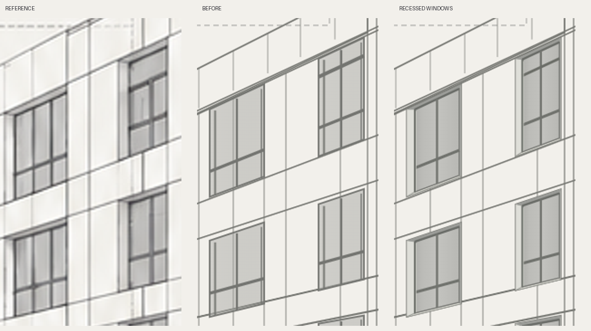
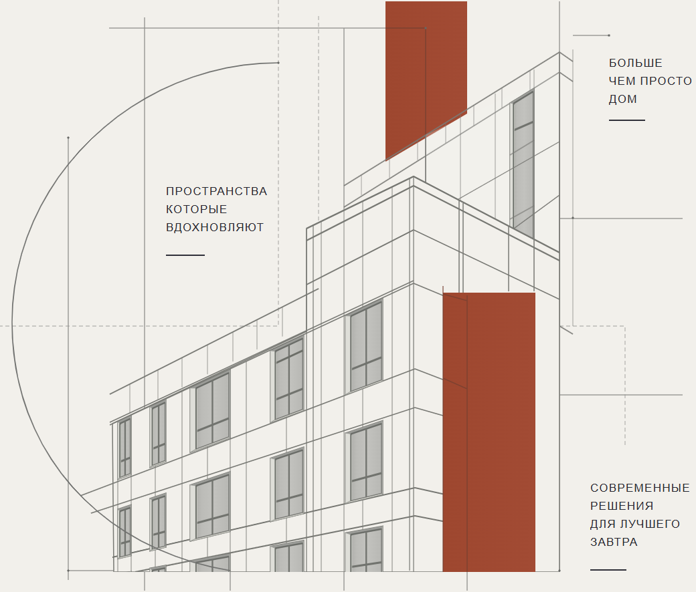

# Утопленные оконные проёмы

Правка по замечанию: в первой версии SVG окна читались как плоские рамки на стене. Референс показывает толщину стены и стекло за внешней плоскостью фасада.

Обновлены `website/src/assets/company-blueprint.svg` и генератор `website/scripts/build_company_blueprint.py`.

В каждом из 16 окон (15 на переднем фасаде и одно в заднем объёме) отдельно построены внешний проём, левый и правый откосы, верхний откос, подоконная грань, заглублённая плоскость стекла и переплёты. Ширина откоса зависит от ширины проёма; верхняя и нижняя границы сохраняют исходные перспективные наклоны. Самые тёмные штрихи перенесены внутрь проёма. Стекло непрозрачно для нижележащих фасадных линий, что исключает ложные переплёты.

## Проверка

После первой итерации оттенки стекла и рам нейтрализованы, чтобы убрать зеленоватый тон. Проверены крупный фрагмент и весь фасад в Chromium. XML валиден: 234 path, 16 групп `data-window="recessed"`. Структура основных анимационных групп сохранена. SVG остаётся чистым вектором без изображений.

## Figma

Исправленный SVG успешно импортирован через Computer Use в существующий файл «евразия делюкс» на страницу «Траст Строй — векторный чертёж».

[Чертёж — утопленные окна v2](https://www.figma.com/design/xSOEliHVePMIXSK41PYSrF/?node-id=13-346)

Новая версия расположена в x=600, y=0 рядом с предыдущей версией, вставленной пользователем. Предыдущая сохранена для сравнения. Фон страницы установлен `#F2F0EB`, чтобы прозрачный SVG оценивался на фоне референса. На холсте визуально проверены исправленные окна; раскрытие `windows` подтвердило 15 отдельных редактируемых групп `window-1-1` — `window-3-5`. Заднее окно входит в `rear-volume`.
